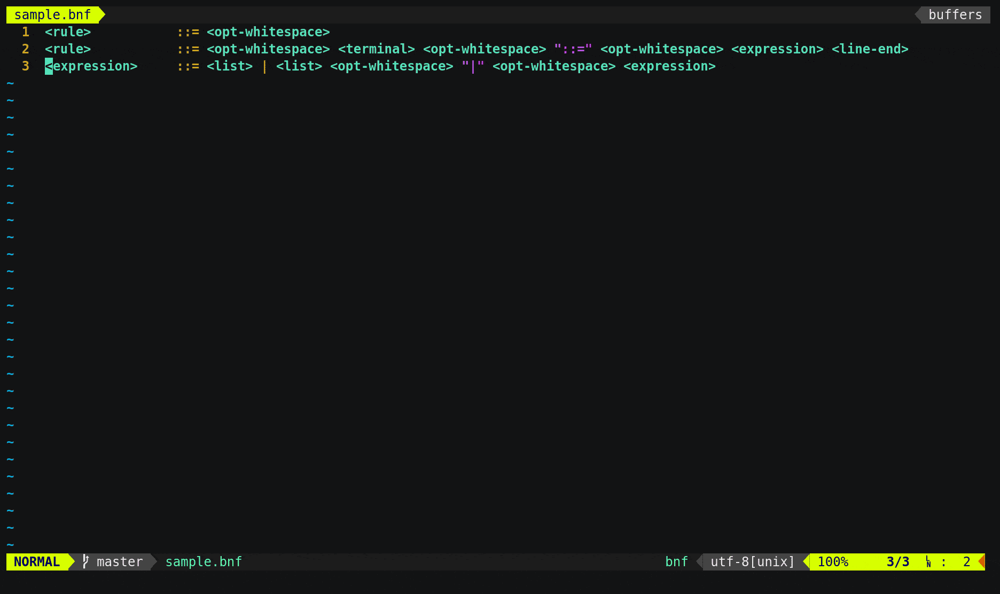

# Nvim-BNF

*NeoVim semantic syntax highlighting plugin for BNF grammar*

## Overview

**nvim-bnf** is a remote [NeoVim](https://github.com/neovim/neovim) plugin
which provides both syntactical and semantical highlighting and autocompletion
based on [NCM2](https://github.com/ncm2/ncm2) for grammars written in
[Backus-Naur form (BNF)][3]. The plugin is written in Golang and governs
MsgPack RPC protocol according to NeoVim specification. So there is only a
little hunk of code written in VimL which performs registration and
bootstrapping the plugin.



## Installation

In order to install one could use his or her favourite plugin manager like
[Plug](https://github.com/junegunn/vim-plug). Surely, [Golang workspace][2]
must be set up before. It could look something like on the following code
snippet.

```vim
    call plug#begin('~/.config/nvim/plugged')
        Plug 'daskol/nvim-bnf', { 'do': 'go install ./cmd/nvim-nbf' }
    call plug#end()
```

## Development

NeoVim requires [manifest][1] for remote plugins. There is no reason to write
it manually since the plugin provides ability to generate manifest as follows.

```bash
    $ ./nvim-bnf --gen-manifest
    call remote#host#RegisterPlugin('nvim-bnf', '0', [
    \ {'type': 'autocmd', 'name': 'BufNewFile', ... },
    \ {'type': 'autocmd', 'name': 'BufRead', ... },
    \ ])
```

[1]: https://neovim.io/doc/user/remote_plugin.html#remote-plugin-manifest
[2]: https://golang.org/doc/code.html
[3]: https://en.wikipedia.org/wiki/Backus%E2%80%93Naur_form
